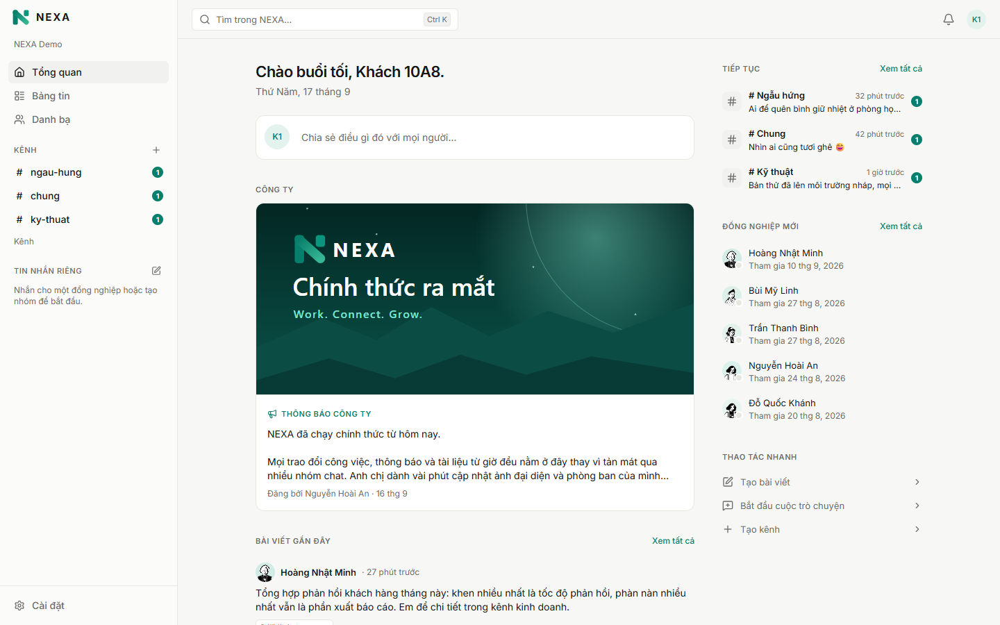
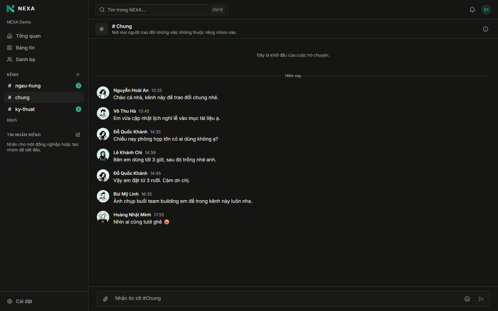
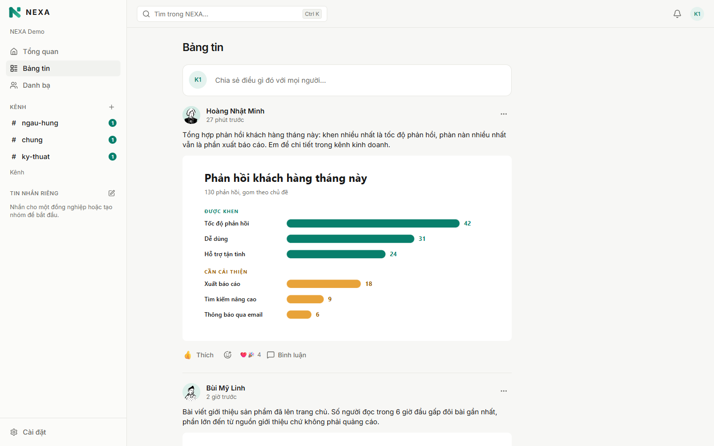
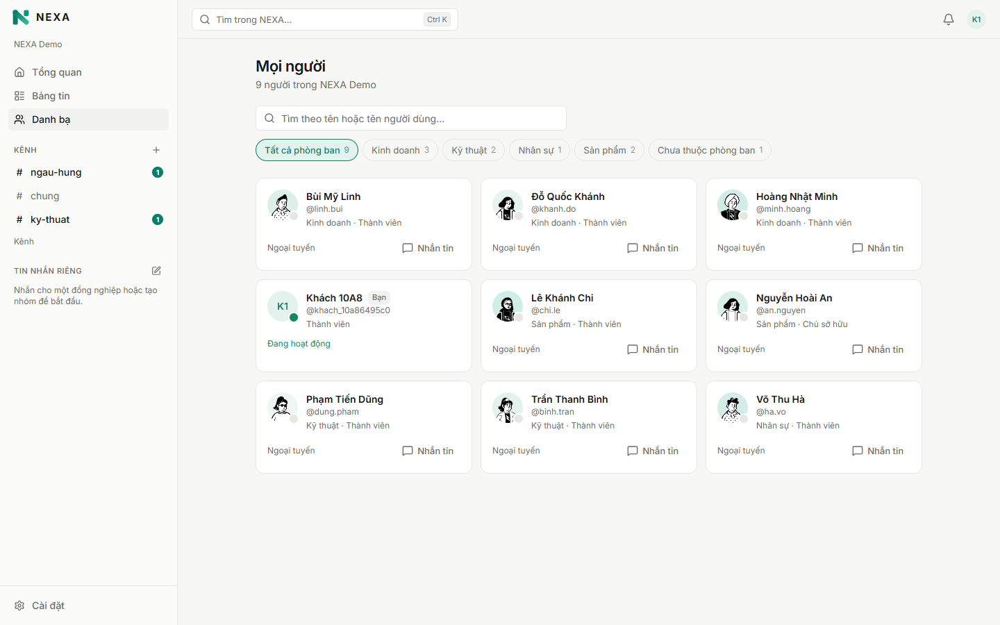
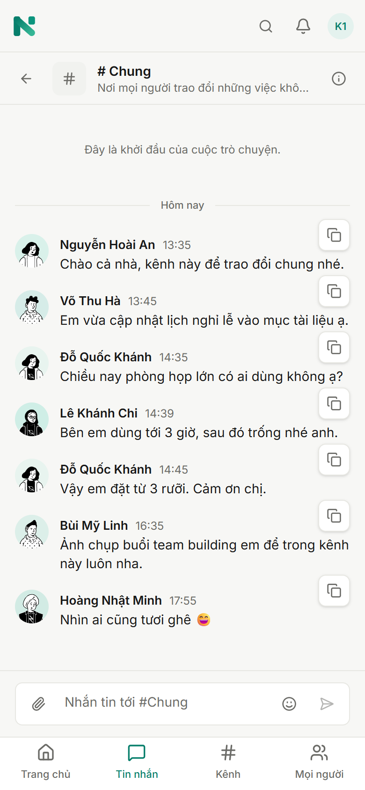

# NEXA Workplace

[](https://github.com/shawnjericson/nexa/actions/workflows/ci.yml)

**[Live demo](https://nexa.anhdlttech.io.vn)** - one click, no sign-up ·
**[API docs](https://api.nexa.anhdlttech.io.vn/docs/)** ·
[Architecture decisions](docs/adr/README.md)

Private social + communication platform for organizations: company feed, chat, organization &
identity, notifications. It started as a Node.js exam (Social Media API) and grows into the NEXA v1
platform.



<table>
  <tr>
    <td width="50%"></td>
    <td width="50%"></td>
  </tr>
  <tr>
    <td width="50%"></td>
    <td width="50%" align="center">
      
    </td>
  </tr>
</table>

The interface is Vietnamese first, with English one click away (a first visit follows the
browser's language). The demo company's content is in Vietnamese.

## Highlights

- **Modular monolith** - eight modules (identity, organization, social, communication, file,
  search, notification, administration), each layered routes → controllers → services →
  repositories, reacting to each other only through domain events.
- **Multi-tenant by construction** - every row carries its organization, and composite foreign keys
  keep comments, reactions and messages inside the organization they belong to
  ([ADR-012](docs/adr/012-per-organization-roles-and-onboarding.md)).
- **Real-time chat** over Socket.IO with a Redis adapter: server-assigned sequence numbers,
  idempotent sends, read receipts and presence
  ([ADR-015](docs/adr/015-chat-and-realtime.md)).
- **Sessions** - 15-minute JWTs and rotating refresh tokens with reuse detection, bcrypt, Google
  sign-in, rate limits on everything that can be abused.
- **Search** - PostgreSQL full-text search that ignores Vietnamese accents, with each module
  enforcing its own visibility ([ADR-018](docs/adr/018-search.md)).
- **Files** - presigned uploads straight to Cloudflare R2, content checks and cleanup of
  abandoned uploads ([ADR-017](docs/adr/017-files-and-object-storage.md)).
- **260+ integration tests** against a real PostgreSQL; every green push to `master` deploys
  itself ([Deploying](#deploying)).

Documents: architecture specification, risk register and design system in
[`docs/specs/`](docs/specs) (PDF), and the decisions made since in [`docs/adr/`](docs/adr/README.md).

## Stack

| Layer            | Technology                                                                  |
| ---------------- | --------------------------------------------------------------------------- |
| Runtime          | Node.js 22, TypeScript                                                      |
| HTTP             | Express 5                                                                   |
| Database         | PostgreSQL 18 via Prisma 7 (TLS, pinned cert)                               |
| Realtime         | Socket.IO 4 + Redis adapter (multi-instance fan-out)                        |
| Cache / presence | Redis 8 (TLS, ACL user limited to `nexa:*`)                                 |
| Logs / events    | MongoDB 8 (audit + event log, see ADR-009)                                  |
| Auth             | JWT access tokens (jose) + rotating refresh                                 |
| Passwords        | bcrypt                                                                      |
| Validation       | Zod 4                                                                       |
| API docs         | OpenAPI 3 + Swagger UI                                                      |
| Logging          | pino (JSON in production, pretty in development)                            |
| Web              | Next.js 16 (App Router), React 19, Tailwind 4, TanStack Query, Radix UI     |
| Tests            | Vitest + Supertest + socket.io-client against real PostgreSQL/Redis/MongoDB |

## Repository layout

```
apps/
  api/                    NEXA API (modular monolith)
    prisma/               schema + migrations
    src/
      config/             environment validation
      infrastructure/     database, redis, mongo, storage (S3/R2), websocket (realtime hub), logger
      modules/
        identity/         register, login, tokens, sessions, profiles
        organization/     organizations, memberships, roles & permissions, org context
        social/           posts, comments, reactions, feed
        communication/    direct/group/channel chat, messages, read state, presence, sockets
        file/             uploads to object storage, content checks, attachments, cleanup
        search/           full-text search across modules, each enforcing its own visibility
        notification/     in-app notifications from domain events (coalesced, realtime)
        administration/   audit log (MongoDB, PostgreSQL fallback queue)
      shared/             errors, HTTP helpers, domain events
      app.ts              composition root + Express pipeline
      server.ts           process entry point
    test/                 integration tests
  web/                    NEXA web app (Next.js): app/, features/, components/, i18n/
packages/
  api-client/             typed client generated from the API's OpenAPI document
docs/
  adr/                    architecture decision records
  specs/                  original specification documents
```

Each module follows `domain/ → application/ → infrastructure/ → presentation/` and exposes a
public contract through its `index.ts`. A request passes through the layers in order:

| Layer                            | Holds                                                       |
| -------------------------------- | ----------------------------------------------------------- |
| `presentation/*routes.ts`        | Paths, rate limits, auth guards, validation - no logic      |
| `presentation/*.controller.ts`   | Read the request, call a service, shape the response (DTO)  |
| `application/*.service.ts`       | Use cases: authorization, rules, transactions, events       |
| `domain/`                        | Entities, policies, errors and the ports services depend on |
| `infrastructure/*.repository.ts` | Prisma, Redis, MongoDB and storage behind those ports       |

Modules never reach into each other's repositories; cross-module reactions go through domain events
(e.g. `identity.user_registered` → the Organization module adds the user to the default
organization).

## Run it on your machine

Requirements: Node.js 22+, pnpm 10 (`corepack enable`) and Docker. Only PostgreSQL is needed;
Redis, MongoDB and object storage are optional, and the API runs without them.

```bash
docker compose up -d --wait                  # PostgreSQL 18 on localhost:5432
pnpm install
cp apps/api/.env.local.example apps/api/.env
pnpm --filter @nexa/api db:generate          # generate the Prisma client
pnpm --filter @nexa/api db:deploy            # create the tables
pnpm --filter @nexa/api seed:demo -- --org nexa --create --name NEXA --yes   # sample company

pnpm dev                                     # API on http://localhost:4000 (docs: /docs)
pnpm dev:web                                 # web app on http://localhost:3000
```

Open http://localhost:3000 and choose **Try it now**, or register: anyone who registers joins the
sample company. `pnpm test` runs the integration tests against `nexa_test` in the same container.
CI goes through these exact steps on every push (the _Run it on your machine_ job), so they keep
working.

## Development against the shared databases

The maintainers' setup: the PostgreSQL, Redis and MongoDB instances on the VPS, reachable only
from allowlisted addresses (see ADR-011).

```bash
pnpm install
cp apps/api/.env.example apps/api/.env   # fill in the real credentials and JWT secret

# Pin the database server certificate (self-signed) for TLS
mkdir -p apps/api/certs
echo | openssl s_client -starttls postgres -connect DB_HOST:5432 2>/dev/null \
  | openssl x509 -outform PEM > apps/api/certs/postgres-server.pem

pnpm --filter @nexa/api db:generate      # generate the Prisma client
pnpm --filter @nexa/api db:migrate       # apply migrations
pnpm dev                                 # API on http://localhost:4000
pnpm dev:web                             # web app on http://localhost:3000
```

Compare the fingerprint with the server's once, to rule out a man-in-the-middle:

```bash
openssl x509 -in apps/api/certs/postgres-server.pem -noout -fingerprint -sha256
# on the server: openssl x509 -in /etc/ssl/certs/ssl-cert-snakeoil.pem -noout -fingerprint -sha256
```

| URL             | Purpose                       |
| --------------- | ----------------------------- |
| `GET /health`   | Liveness                      |
| `GET /ready`    | Readiness (checks PostgreSQL) |
| `/docs`         | Swagger UI                    |
| `/openapi.json` | OpenAPI document              |
| `/api/v1/*`     | NEXA API                      |
| `/api/*`        | Same endpoints, exam contract |

## Exam requirements

The exam brief is the course's Social Media API specification (course material, so it is not in
this repository). Its routes live under
`/api/*` next to NEXA's `/api/v1/*`, over the same services (ADR-010).
[`apps/api/test/exam-srs.test.ts`](apps/api/test/exam-srs.test.ts) checks every requirement the way
the exam does: through `/api/*`, with exactly the payloads the brief lists and no NEXA extras.

| Brief                                     | Where                                                                                                                               |
| ----------------------------------------- | ----------------------------------------------------------------------------------------------------------------------------------- |
| Node.js, ExpressJS, JWT                   | Express 5; HS256 access tokens (`jose`)                                                                                             |
| Database with an ORM                      | PostgreSQL 18 with Prisma 7                                                                                                         |
| §2 User: id, username, email, avatar...   | `users`; responses carry `avatar` as well as `avatar_url`                                                                           |
| §2 Post: id, user_id, content, image_url  | `posts`; responses carry `user_id` as well as the `author` object                                                                   |
| §2 Comment: id, post_id, user_id...       | `comments`; responses carry `user_id` as well as `author`                                                                           |
| §3.1 `POST /api/auth/register`, `/login`  | Returns the user without the password; login returns `access_token`                                                                 |
| §3.2 `GET /api/users/me`, `/:id`, `PUT`   | `PUT /api/users/me` takes `avatar` and `username`                                                                                   |
| §3.3 `/api/posts` with `page` & `limit`   | `pagination: { page, limit, total, total_pages, has_next }`                                                                         |
| §3.3 `PUT`/`DELETE /api/posts/:id`        | Author only - on these routes not even a moderator (see below)                                                                      |
| §3.4 `/api/comments/post/:postId`, `/:id` | Delete is author only                                                                                                               |
| §4 Layered architecture                   | Each module: routes (`*routes.ts`) → controllers (`*.controller.ts`) → services (`application/`) → repositories (`infrastructure/`) |
| §4 bcrypt                                 | `bcryptjs`, 12 rounds                                                                                                               |
| §4 JWT middleware                         | `requireAuth` on every exam route except auth                                                                                       |
| §4 Author-only edits and deletes          | Policies in each module's `domain/policies.ts`                                                                                      |
| §4 Validation (email, password ≥ 6)       | Zod schemas, applied by the `validate` middleware                                                                                   |
| §4 Global error handler                   | One handler; every error is `{ "error": "...", "status": 400, ... }`                                                                |

NEXA lets organization moderators remove other people's content (ADR-013). The exam has no
moderators, and the first person to register owns the default organization - so requests through
`/api/*` act without the moderation permission, and there only the author may edit or delete.

The exam knows nothing about organizations, so its flow needs `SIGNUP_MODE=open`: a new account
joins `DEFAULT_ORG_SLUG` and can post straight away. Under `invite` a new account belongs to no
organization, and the exam's `POST /api/posts` answers 403.

## Web app

`apps/web` is the NEXA workspace in the browser (ADR-019). It follows the Frontend & Design System
Specification and the brand sheet in `docs/specs/`.

| Route                        | What it is                                                                |
| ---------------------------- | ------------------------------------------------------------------------- |
| `/home`                      | Briefing: unread messages and notifications, announcements, quick actions |
| `/feed`, `/feed/:id`         | Posts with attachments, reactions and comments                            |
| `/messages`, `/messages/:id` | Direct, group and channel conversations, in realtime                      |
| `/channels`                  | Browse, join and create channels                                          |
| `/people`, `/people/:id`     | Directory by department with presence, and profiles                       |
| `/search`                    | People, posts, channels and messages (also in the Ctrl/Cmd+K palette)     |
| `/settings`                  | Profile, password, theme, language and organizations                      |
| `/admin`                     | Members, invitations, departments, audit log, organization (by role)      |
| `/invite?token=`             | Accept an invitation link                                                 |

- Activity about you lives in the bell in the top bar, grouped by day, not on a page of its own.
- The UI is in Vietnamese by default, with English one click away. Light and dark themes follow the
  system.
- Sign-in goes through the Next.js server: the refresh token stays in an httpOnly cookie, and only a
  short-lived access token reaches the page.
- The API client is generated from the API's OpenAPI document. After changing the API contract,
  run `pnpm api-client:generate`; the web typecheck then shows what needs updating.
- To try the UI without touching the development database, run the API against the test database
  with `pnpm --filter @nexa/api dev:qa`. That mode also turns off the audit log and uploads to the
  test bucket.
- `apps/web/.env.example` lists the settings: `NEXT_PUBLIC_API_URL` for the browser and `API_URL`
  for the Next.js server.

## Authentication

| Method | Endpoint                       | Auth   | Description                                    |
| ------ | ------------------------------ | ------ | ---------------------------------------------- |
| POST   | `/api/v1/auth/register`        | -      | Create an account (joins the default org)      |
| POST   | `/api/v1/auth/login`           | -      | Returns `access_token` + `refresh_token`       |
| POST   | `/api/v1/auth/oauth/google`    | -      | Signs in with a Google ID token                |
| POST   | `/api/v1/auth/oauth/link`      | -      | Links Google to an existing account (password) |
| POST   | `/api/v1/auth/refresh`         | -      | Rotates the refresh token, returns a new pair  |
| POST   | `/api/v1/auth/logout`          | -      | Ends the session of a refresh token            |
| POST   | `/api/v1/auth/change-password` | Bearer | Changes password, signs out other sessions     |
| GET    | `/api/v1/users/me`             | Bearer | Current profile                                |
| PUT    | `/api/v1/users/me`             | Bearer | Update username, display name, avatar, bio     |
| GET    | `/api/v1/users/:id`            | Bearer | Profile of someone sharing an organization     |
| PUT    | `/api/v1/users/me/avatar`      | Bearer | Sets the profile picture to an uploaded file   |
| DELETE | `/api/v1/users/me/avatar`      | Bearer | Removes the profile picture                    |
| GET    | `/api/v1/avatars/:fileId`      | -      | Redirects to the picture, cacheable            |

- Access tokens are HS256 JWTs valid for 15 minutes and carry only `sub` (user) and `sid`
  (session). Permissions are resolved server-side on every request, never read from the token.
- Refresh tokens are random 256-bit strings valid for 30 days; only their SHA-256 hash is stored.
  Each refresh rotates the token. Replaying a used token revokes the whole session.
- Sign in with Google runs the authorization code flow with PKCE on the Next.js server; the API
  verifies the ID token itself against Google's JWKS, including the nonce (ADR-020).
- A Google account is never linked to an existing account by matching e-mail addresses, because
  registration does not verify them. The API answers `409 ACCOUNT_LINK_REQUIRED` with a link token
  valid for 10 minutes, and the link only happens after the password is confirmed.
- Profile pictures are ordinary uploads: the file is uploaded like any other, then set as the
  avatar. `/api/v1/avatars/:fileId` is public so pictures can be cached and shown anywhere.
- `SIGNUP_MODE` decides who ends up inside the organization. `open` (the default, ADR-010) puts
  everyone who registers into `DEFAULT_ORG_SLUG` - what the exam expects, and what makes a demo
  usable. `invite` gives a new account nothing but the account: it belongs to no organization
  until it accepts an invitation, which is bound to the invited e-mail address. **A workspace on a
  public address wants `invite`.** Under `open`, anyone who finds the sign-up page joins the one
  organization and can then read the staff directory, the feed and every channel in it.
- Deactivated accounts lose access immediately, even with an unexpired access token.
- Login answers identically for unknown emails and wrong passwords, and auth endpoints are
  rate-limited.

## Organizations & social

Every social request runs inside one organization. It is taken from the optional
`X-Organization-Id` header, **validated against your membership**. If you belong to a single
organization, that one is used automatically. Suspended or removed members lose access
immediately.

| Method | Endpoint                      | Exam equivalent                   | Who                 |
| ------ | ----------------------------- | --------------------------------- | ------------------- |
| GET    | `/api/v1/feed?cursor&limit`   | `GET /api/posts?page&limit`       | members             |
| POST   | `/api/v1/posts`               | `POST /api/posts`                 | members             |
| GET    | `/api/v1/posts/:id`           | `GET /api/posts/:id`              | members             |
| PUT    | `/api/v1/posts/:id`           | `PUT /api/posts/:id`              | author only         |
| DELETE | `/api/v1/posts/:id`           | `DELETE /api/posts/:id`           | author or moderator |
| GET    | `/api/v1/posts/:id/comments`  | `GET /api/comments/post/:postId`  | members             |
| POST   | `/api/v1/posts/:id/comments`  | `POST /api/comments/post/:postId` | members             |
| DELETE | `/api/v1/comments/:id`        | `DELETE /api/comments/:id`        | author or moderator |
| POST   | `/api/v1/posts/:id/reactions` | -                                 | members             |
| DELETE | `/api/v1/posts/:id/reactions` | -                                 | members             |

- Posts and comments of other organizations answer **404**, never 403.
- Deletes are soft. Deleting a comment removes its replies; replies are one level deep.
- `ANNOUNCEMENT` posts need the `announcement.publish` permission. A moderator is anyone with
  `post.moderate`, which OWNER and ADMIN have.
- Reactions (`LIKE`, `LOVE`, `HAHA`, `CELEBRATE`, `SAD`): one per person and post, and reacting
  again replaces it. Posts include per-type counts and your own reaction.
- `/api/v1` lists use cursor pagination (`pagination.next_cursor`); the exam routes use
  `page`/`limit` with totals. See ADR-013.

## Organization management

| Method       | Endpoint                                                        | Permission                                            |
| ------------ | --------------------------------------------------------------- | ----------------------------------------------------- |
| GET / POST   | `/api/v1/organizations`                                         | signed in                                             |
| GET / PUT    | `/api/v1/organizations/:organizationId`                         | member / `organization.update`                        |
| GET          | `/api/v1/organizations/:organizationId/members`                 | member                                                |
| PATCH        | `/api/v1/organizations/:organizationId/members/:userId`         | `member.role.update` (role), `member.remove` (status) |
| DELETE       | `/api/v1/organizations/:organizationId/members/:userId`         | `member.remove`, or yourself (leave)                  |
| GET / POST   | `/api/v1/organizations/:organizationId/invitations`             | `member.invite`                                       |
| DELETE       | `/api/v1/organizations/:organizationId/invitations/:id`         | `member.invite`                                       |
| POST         | `/api/v1/invitations/accept`                                    | the invited email                                     |
| GET / POST   | `/api/v1/organizations/:organizationId/departments`             | member / `department.manage`                          |
| PUT / DELETE | `/api/v1/organizations/:organizationId/departments/:id`         | `department.manage`                                   |
| GET          | `/api/v1/organizations/:organizationId/departments/:id/members` | member                                                |
| PUT / DELETE | `.../departments/:id/members/:userId`                           | `department.manage`                                   |

- **Role hierarchy** OWNER > ADMIN > MANAGER > MEMBER: you can only manage members ranked below
  you and grant roles below your own; only OWNERs grant OWNER.
- **The last active OWNER** can never be demoted, suspended or removed. Membership changes are
  serialized with a row lock on the organization.
- **Invitations**: the token is shown once, stored hashed, valid 7 days, and only the invited
  email can accept it, exactly once.
- **Departments**: leaving the organization removes you from its departments automatically.
- See ADR-014.

## Chat & realtime

| Method         | Endpoint                                                  | Notes                                           |
| -------------- | --------------------------------------------------------- | ----------------------------------------------- |
| GET            | `/api/v1/conversations?limit&cursor`                      | Your conversations, latest first, unread counts |
| POST           | `/api/v1/conversations`                                   | `DIRECT` (idempotent), `GROUP`, `CHANNEL`       |
| GET / PATCH    | `/api/v1/conversations/:id`                               | Members + read positions / rename, archive      |
| POST           | `/api/v1/conversations/:id/members`                       | Add people (owners/admins) or join a channel    |
| DELETE         | `/api/v1/conversations/:id/members/:userId`               | Leave, or remove someone (owners/admins)        |
| GET            | `/api/v1/conversations/:id/messages?before_seq/after_seq` | History; `after_seq` catches up after reconnect |
| POST           | `/api/v1/conversations/:id/messages`                      | Send with a `client_message_id` (retry-safe)    |
| PATCH / DELETE | `/api/v1/conversations/:id/messages/:messageId`           | Edit (sender) / delete, leaving a tombstone     |
| POST           | `/api/v1/conversations/:id/read`                          | Read position, never moves backwards            |
| GET            | `/api/v1/channels`                                        | Browse the organization's channels              |
| GET            | `/api/v1/presence?user_ids=a,b`                           | Online status                                   |

Realtime uses Socket.IO with the same access token and organization rules as the REST API:

```js
const socket = io('http://localhost:4000', { auth: { token: accessToken, organization_id } });
socket.on('message.created', (message) => render(message));
socket.emit('typing.start', { conversation_id }, (ack) => console.log(ack)); // { ok: true }
```

| Direction       | Events                                                                                                                                                          |
| --------------- | --------------------------------------------------------------------------------------------------------------------------------------------------------------- |
| server → client | `message.created`, `message.updated`, `message.deleted`, `message.read`, `typing.started`, `typing.stopped`, `presence.updated`, `conversation.members_changed` |
| client → server | `typing.start`, `typing.stop` (acknowledged with `{ ok }`)                                                                                                      |

- Messages are ordered by a server-assigned, gap-free `seq`. Resending the same
  `client_message_id` returns the original message instead of a duplicate.
- You can edit or delete your own message for 15 minutes after sending it, and not after
  (`MESSAGE_CHANGE_WINDOW_EXPIRED`): long enough to fix a typo, short enough that nobody rewrites
  a conversation others have already acted on. Moderators are not held to it, because taking down
  something harmful has to stay possible however old it is. Edits are marked, and a delete leaves
  a tombstone either way.
- After a reconnect, fetch `messages?after_seq=<last seq you have>`.
- Direct and group conversations are private: organization admins get 404 like everyone else.
  Leaving the organization removes you from every conversation.
- Presence counts connections, so closing the laptop while the phone is connected keeps you online.
- Without `REDIS_URL` the API runs as a single instance with in-process presence. See ADR-015.

## Notifications & audit log

| Method | Endpoint                                         | Notes                              |
| ------ | ------------------------------------------------ | ---------------------------------- |
| GET    | `/api/v1/notifications?limit&cursor&unread_only` | Latest activity first              |
| GET    | `/api/v1/notifications/unread-count`             | Badge count                        |
| PATCH  | `/api/v1/notifications/:id/read`                 | Idempotent                         |
| POST   | `/api/v1/notifications/read-all`                 | Returns how many were marked read  |
| GET    | `/api/v1/audit-logs?limit&cursor&action`         | Needs `audit.read` (owners/admins) |

- You are notified about:
  - comments on your posts, and replies to your comments;
  - new reactions to your posts;
  - announcements;
  - chat messages;
  - changes to your role.

  You are never notified about your own actions.

- Bursts are grouped: "Bob, An and 3 others commented" is one notification with `count` and
  `actors`, until you read it.
- New and updated notifications arrive over Socket.IO as `notification.created`; upsert them by
  `id`.
- The audit log records organization, membership, department and moderation actions in MongoDB.
  While MongoDB is down, entries wait in PostgreSQL and are retried every 30 s.
- Without `MONGODB_URI` the audit log is disabled. See ADR-016.

## Files

| Method | Endpoint                     | Notes                                              |
| ------ | ---------------------------- | -------------------------------------------------- |
| POST   | `/api/v1/files`              | Start an upload; returns a presigned `PUT` URL     |
| POST   | `/api/v1/files/:id/complete` | Verifies the upload (size and actual content type) |
| GET    | `/api/v1/files/:id`          | One of your uploads                                |

```js
const { data } = await api.post('/api/v1/files', {
  filename: file.name,
  content_type: file.type,
  size: file.size,
});
await fetch(data.upload.url, { method: 'PUT', headers: data.upload.headers, body: file });
await api.post(`/api/v1/files/${data.file.id}/complete`);
await api.post('/api/v1/posts', { content: 'Team outing', attachment_ids: [data.file.id] });
```

- The bytes go straight to object storage (Cloudflare R2), never through the API. The bucket is
  private and every URL is presigned.
- Allowed types: JPEG, PNG, GIF, WebP, MP4, PDF, Word/Excel/PowerPoint, ZIP, TXT and CSV.
  - The size limit is 25 MB (`FILE_MAX_BYTES`).
  - Completing an upload checks the actual bytes, so a renamed `.exe` is rejected and deleted.
- Attach up to 10 of your own `READY` files to a post or chat message with `attachment_ids`.
  - Attachments come back with download URLs valid for at least an hour.
  - People only get those URLs for posts and conversations they can already see.
- Deleting a message removes its files; deleting a post keeps them for moderation.
- Cleanup:
  - uploads that are never completed fail after an hour;
  - files nothing uses are purged after 7 days.
- Uploading from a browser needs a CORS rule on the bucket allowing `PUT` from the web app's
  origin.
- Without `S3_BUCKET` uploads are disabled. See ADR-017.

## Search

| Method | Endpoint                                  | Notes                                                  |
| ------ | ----------------------------------------- | ------------------------------------------------------ |
| GET    | `/api/v1/search?q=&limit=`                | The best few people, posts, conversations and messages |
| GET    | `/api/v1/search/people?q=&limit=&cursor=` | Members of your organization, by name or username      |
| GET    | `/api/v1/search/posts?q=&limit=&cursor=`  | Posts of your organization                             |
| GET    | `/api/v1/search/conversations?q=&...`     | Channels, and groups you are in                        |
| GET    | `/api/v1/search/messages?q=&...`          | Messages of conversations you are in                   |

- Search ignores accents and case, and every word matches as a prefix: `bao cao` finds
  "Báo cáo", and `phat` finds "phát triển".
- You only find what you can already see. Direct and group messages stay private, even from
  organization admins.
- Posts and messages come with a `snippet` and the `highlights` to mark in it.
- Results are PostgreSQL full-text search over generated columns, so new content is searchable
  immediately. See ADR-018.

## Scripts

| Command                     | Description             |
| --------------------------- | ----------------------- |
| `pnpm dev`                  | Run the API with reload |
| `pnpm build` / `pnpm start` | Production build / run  |
| `pnpm test`                 | Run all tests           |
| `pnpm typecheck`            | TypeScript checks       |
| `pnpm lint` / `pnpm format` | ESLint / Prettier       |

Filling an empty workspace with something to look at:

```bash
pnpm --filter @nexa/api seed:demo -- --org nexa            # says what it would do, writes nothing
pnpm --filter @nexa/api seed:demo -- --org nexa --yes      # colleagues, departments, posts, channels
pnpm --filter @nexa/api seed:demo -- --org nexa --yes --reset  # replace what it made before

# Safest of all: give the demo an organization of its own, owned by a real account so you can
# switch into it. Nothing it writes can reach the workspace people actually use.
pnpm --filter @nexa/api seed:demo -- --org demo --create --name "NEXA Demo"   --owner you@example.com --yes
```

It writes to whatever `DATABASE_URL` points at, prints the database and organization first, and
does nothing at all without `--yes`. Everyone it invents has an e-mail at `demo.nexa.local`, which
is what `--reset` deletes: nobody else's content is touched. Run twice, it adds nothing the second
time. Demo accounts get a random password unless `SEED_PASSWORD` is set - they exist to be seen,
not signed in to.

Tests run against the database in `TEST_DATABASE_URL`. Its name must end in `_test`, because tests
truncate tables. Migrations are applied to it automatically before the suite starts.

## API response contract

```jsonc
// success
{ "success": true, "data": { } }

// error (satisfies both the exam format and NEXA v1, see ADR-010)
{ "success": false, "status": 404, "error": "Post not found", "code": "POST_NOT_FOUND", "request_id": "req_..." }
```

Status codes: 400 validation, 401 authentication, 403 authorization, 404 not found, 409 conflict,
413 payload too large, 422 rejected content, 429 rate limit, 500 unexpected, 503 dependency
unavailable.

## Deploying

Both apps run under PM2 behind Nginx: `nexa-api` on port 4100 and `nexa-web` on port 3100, each
with its own subdomain and certificate. Nginx proxies `/socket.io/` with the upgrade headers.

Rate limits are per client address, so the API has to see the real one. Every `location` that
proxies to either app sets

```nginx
proxy_set_header X-Forwarded-For $proxy_add_x_forwarded_for;
proxy_set_header X-Forwarded-Proto $scheme;
```

and the API runs with `TRUST_PROXY=1`, which takes the address Nginx appended. The order matters:
with `TRUST_PROXY=1` but no such header from Nginx, the API would believe whatever
`X-Forwarded-For` a client sends, and anyone could dodge the limits. With neither (how it first
ran), every visitor looks like `127.0.0.1`, so the whole site shares one allowance - ten demo
starts an hour, for everyone. The web app's session routes pass the header on to the API.

Pushing to `master` deploys. The workflow in `.github/workflows/ci.yml` first runs the checks
(formatting, ESLint, TypeScript, the whole test suite against a throwaway PostgreSQL, and both
builds); only if they pass does it open an SSH session to the server and run `scripts/deploy.sh`
with the commit it just tested.

The key CI holds cannot do anything else: its line in the server's `authorized_keys` is
`restrict,command=".../scripts/deploy.sh"`, so it deploys and never opens a shell. The address,
port, account and key live in the repository secrets `DEPLOY_HOST`, `DEPLOY_PORT`, `DEPLOY_USER`,
`DEPLOY_SSH_KEY` and `DEPLOY_KNOWN_HOSTS`.

The same script runs by hand on the server, which is also how to recover if a deploy stops halfway:

```bash
scripts/deploy.sh            # deploy origin/master
scripts/deploy.sh <full-sha> # or one particular commit
```

It refuses to run twice at once, and fails loudly if the API does not become ready afterwards. It
deliberately does not roll the code back on its own: by then the migrations have been applied, and
undoing half a deploy can leave the server worse off than stopping does.

Step by step, that script does:

```bash
git fetch origin master && git reset --hard <commit>
pnpm install --frozen-lockfile
pnpm --filter @nexa/api db:generate   # the generated client is not in the repository
pnpm --filter @nexa/api db:deploy     # apply new migrations
pnpm --filter @nexa/api build
pnpm --filter @nexa/web build
pm2 restart nexa-api nexa-web --update-env
```

`db:generate` is not optional. The Prisma client is generated into `apps/api/src/generated`, which
is ignored by git, so a server that skips this step keeps a client built from an older schema: new
models are simply `undefined` at runtime, and the first request that touches one fails with
`Cannot read properties of undefined`.

Production has a database of its own, `nexa_prod`; `nexa` is the development database, so a
migration tried out on a laptop never touches what people are using.

The production `.env` is not a copy of the development one. On the server PostgreSQL, Redis and
MongoDB are reached over localhost without TLS (`DATABASE_SSL=false`, no certificate to pin, and
`redis://` rather than `rediss://`), and `PUBLIC_API_URL` must be the public API address so avatar
redirects point at something the browser can reach.

After deploying, `GET /ready` reports the database and Redis, and `pm2 logs nexa-api` shows startup
errors as JSON.

### Backups and logs

Two jobs in the deploy account's crontab (the server runs on UTC):

```cron
# 02:15 in Vietnam: dump nexa_prod, keep 14 days
15 19 * * * cd $HOME/nexa.anhdlttech.io.vn && node apps/api/scripts/backup-db.mjs >> $HOME/backups/nexa-backup.log 2>&1
# then compress and empty the PM2 logs of nexa-api and nexa-web, keep 14 days
30 19 * * * $HOME/nexa.anhdlttech.io.vn/scripts/rotate-logs.sh >> $HOME/backups/nexa-logs.log 2>&1
```

`backup-db.mjs` writes a `pg_dump` custom-format file to `~/backups/nexa`, checks that it reads
back, and deletes dumps older than `BACKUP_KEEP_DAYS`. A copy on the same disk does not survive
losing the server: set `BACKUP_S3_PREFIX` (e.g. `backups/postgres`) in the API's `.env` and each
dump is also uploaded to the S3/R2 bucket the API already uses, where a lifecycle rule can expire
old ones. To restore into an empty database:

```bash
pg_restore --no-owner --dbname=nexa_restore ~/backups/nexa/nexa_prod-<timestamp>.dump
```

The API logs one JSON line per request at `LOG_LEVEL=info`; `debug` is for chasing a problem, not
for production. `rotate-logs.sh` only touches NEXA's own logs, because PM2 on this server also runs
other applications.
