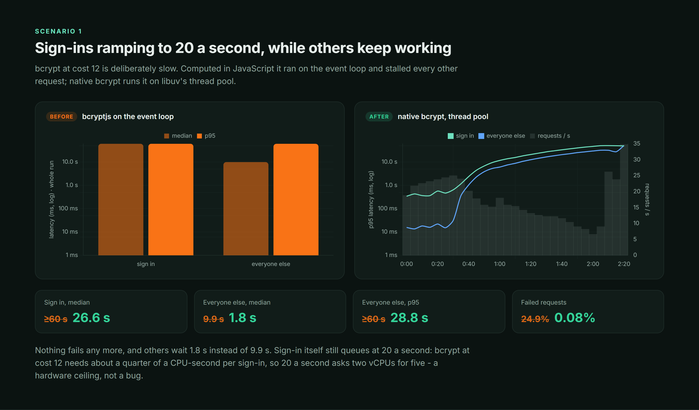
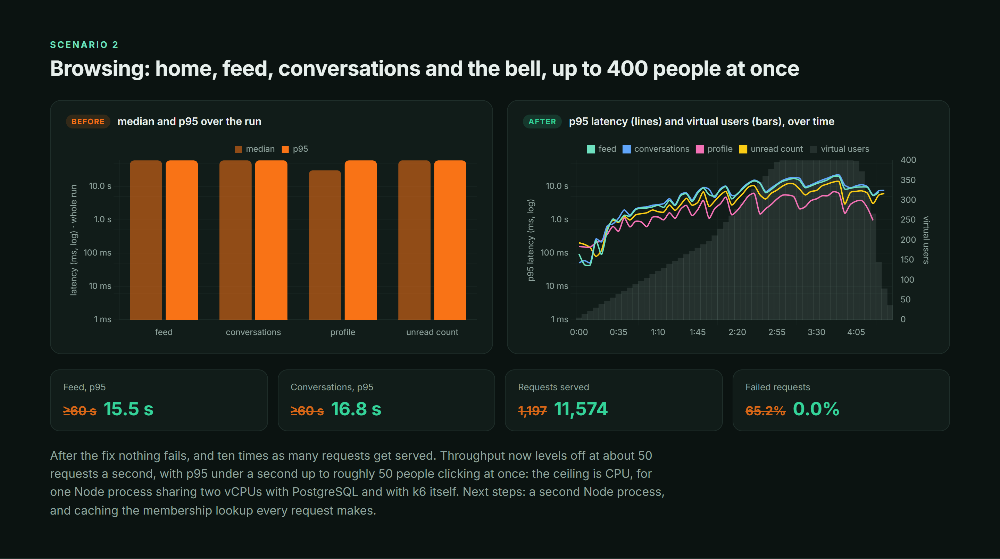
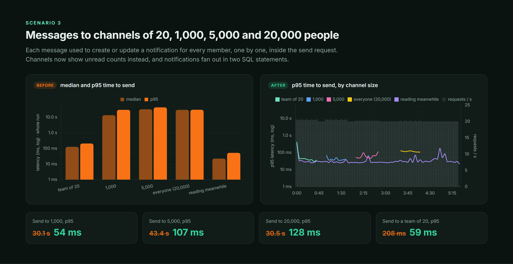
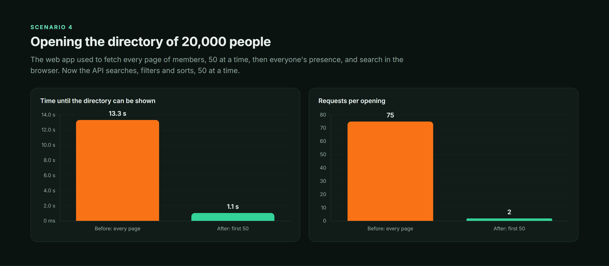
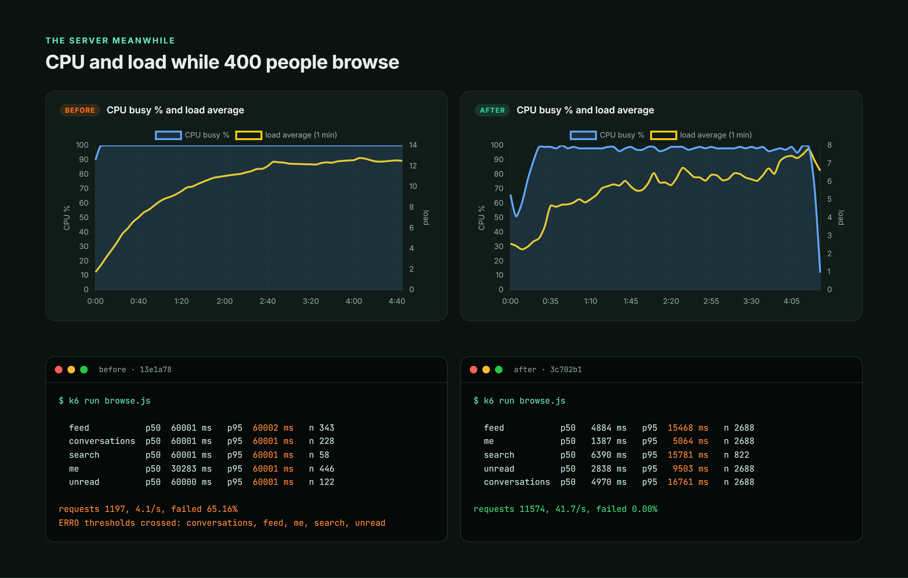

# Performance: a company of 20,000 on a 2-vCPU server

How much NEXA takes, what broke first, and what fixing it bought - measured with k6 against real
data volumes on the production VPS, before and after the fixes (September 2026).

## Setup

- **Hardware:** the production VPS - 2 vCPU (Xeon Skylake), 4 GB RAM - shared with other sites,
  running one Node process for the API, PostgreSQL 18, and k6 itself.
- **Isolation:** a separate checkout and API on `127.0.0.1:4200` against `nexa_test`, rate
  limiting off and no Redis; production was never in the path. A fresh API process for every
  scenario, so one scenario's leftovers are not measured in the next.
- **Data** ([`load/seed.sql`](../load/seed.sql)): 20,000 people in 10 departments; 200,000 posts
  with 200,000 comments and 400,000 reactions; 640,000 messages in 40,203 conversations, with
  channels of 20, 1,000, 5,000 and 20,000 members. 631 MB.
- **Scenarios** ([`load/k6/`](../load/k6)): sign-ins ramping to 20 a second while 20 other
  requests a second keep coming; browsing ramping to 400 people at once; messages to channels of
  every size while others read; opening the directory.

How to run it again: [`load/README.md`](../load/README.md).

## What broke, and why

Each finding came from a measurement, not from reading the code - two of them from code that
looked fine.

### 1. Password hashing stalled every request

bcrypt at cost 12 takes about a quarter of a CPU-second by design. `bcryptjs` computes it in
JavaScript on the event loop, so while sign-ins queued, every other request waited behind them:
unrelated `GET /users/me` calls had a 9.9-second median and a quarter of all requests timed out.
Worse, the hashes k6 had already given up on kept the API busy for minutes after the burst.

**Fix:** native bcrypt (`@node-rs/bcrypt`) on libuv's thread pool - same `$2b$` hashes, same cost.
Demo guests and Google accounts, which never sign in with a password, no longer get a hash at all.

### 2. The feed counted every comment in the database

The feed asked Prisma for each post's comment count with a filter:
`_count: { select: { comments: { where: { deletedAt: null } } } }`. Prisma compiles that to a
`LEFT JOIN` on a subquery that groups **every comment in the table**, then joins the 21 posts on
the page. The `comments(post_id, ...)` index exists, but a filter on 21 post ids can't reach inside
a pre-aggregated subquery. One feed page took **2.3 seconds with nothing else running**; with
people browsing, PostgreSQL sat at 100% CPU and two thirds of all requests - even ones that take
10 ms - timed out waiting behind it.

**Fix:** posts come back without the count; one `groupBy` over the page's post ids adds it, through
the index. The same query: **2.3 s → 40 ms**.

### 3. Every channel message wrote a notification per member

Each message created or updated a "message received" notification for every other member - three
queries per member, one after another, in one transaction, inside the request that sent the
message. Each query was fast; a channel of 20,000 simply made 60,000 of them. Sending took 30
seconds.

**Fix:** channels show what is new with unread counts, like any chat app, and no longer notify per
message. Direct and group conversations still do, and their notifications fan out in two
statements for any number of recipients: all advisory locks in one (sorted, so overlapping events
can't deadlock), then one `UPDATE ... RETURNING` and one `INSERT`.

### 4. The web app downloaded the whole directory

Home, the directory, profiles and every people picker loaded every member, 50 per request, and
searched in the browser - 50 requests for 2,500 people, nobody past 2,500 - then asked for
everyone's presence 100 at a time.

**Fix:** the API searches (accent-insensitive, word prefixes), filters by department and sorts,
one page at a time; members carry their departments; "N online" is one `ZCOUNT` on a
per-organization set in Redis.

## Results

| Scenario                                   | Before                   | After                 |
| ------------------------------------------ | ------------------------ | --------------------- |
| Sign-ins at 20/s: failed requests          | 24.9%                    | **0.08%**             |
| Sign-ins at 20/s: everyone else, median    | 9.9 s                    | **1.8 s**             |
| Browsing up to 400 people: failed requests | 65%                      | **0%**                |
| Browsing up to 400 people: requests served | 1,197 (4/s)              | **11,574 (42/s)**     |
| Send to 1,000 / 5,000 / 20,000, p95        | 30.1 s / 43.4 s / 30.5 s | **54 / 107 / 128 ms** |
| Open the directory, median                 | 13.3 s, 75 requests      | **1.1 s, 2 requests** |
| One feed page, alone                       | 2.3 s                    | **40 ms**             |

Full per-request tables:

Every request, p50 and p95

| Request                         |       Before p50 | Before p95 | After p50 | After p95 |
| ------------------------------- | ---------------: | ---------: | --------: | --------: |
| Sign in                         | ≥ 60 s (timeout) |     ≥ 60 s |    26.6 s |    49.7 s |
| Everyone else during sign-ins   |            9.9 s |     ≥ 60 s |     1.8 s |    28.8 s |
| Profile, browsing               |           30.3 s |     ≥ 60 s |     1.4 s |     5.1 s |
| Feed, browsing                  |           ≥ 60 s |     ≥ 60 s |     4.9 s |    15.5 s |
| Conversations, browsing         |           ≥ 60 s |     ≥ 60 s |     5.0 s |    16.8 s |
| Unread count, browsing          |           ≥ 60 s |     ≥ 60 s |     2.8 s |     9.5 s |
| Search, browsing                |           ≥ 60 s |     ≥ 60 s |     6.4 s |    15.8 s |
| Send to a team of 20            |           127 ms |     208 ms |     37 ms |     59 ms |
| Send to 1,000                   |           13.7 s |     30.1 s |     38 ms |     54 ms |
| Send to 5,000                   |           32.6 s |     43.4 s |     56 ms |    107 ms |
| Send to 20,000                  |           30.2 s |     30.5 s |    114 ms |    128 ms |
| Reading while messages are sent |            22 ms |      52 ms |     22 ms |     34 ms |

## Where the ceiling is now

Nothing fails, but the numbers above are not "fast at 400 people", and it matters to say so:

- **Browsing levels off at about 50 requests a second.** p95 stays under a second up to roughly 50
  people clicking at once. The ceiling is CPU: one Node process sharing two vCPUs with PostgreSQL -
  and with k6, which generates the load on the same machine.
- **Sign-ins at 20 a second still queue.** bcrypt at cost 12 needs about five CPU-seconds a second
  at that rate, and there are two. That is the price of a slow hash, not a bug; the difference is
  that it no longer stops everyone else.
- **The directory sorted by name** takes about a second with ten people opening it at once. The
  sort computes an unaccented name for all 20,000 members on every page; that has not been
  measured on its own yet, but it is the first suspect.

Next steps, in order of expected gain: a second Node process (PM2 cluster, with the rate limiter's
counters moved to Redis); caching the membership and permission lookup every request makes; a
stored sort key for names; and generating load from another machine.
